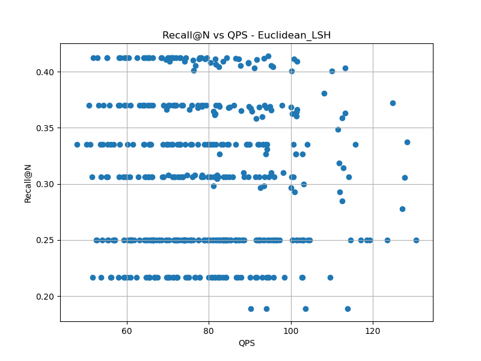
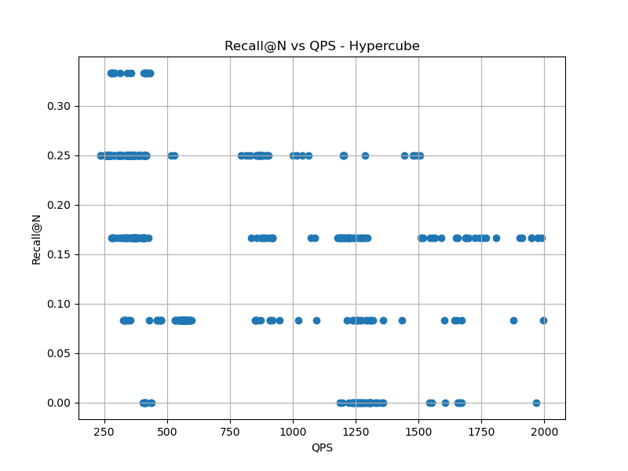
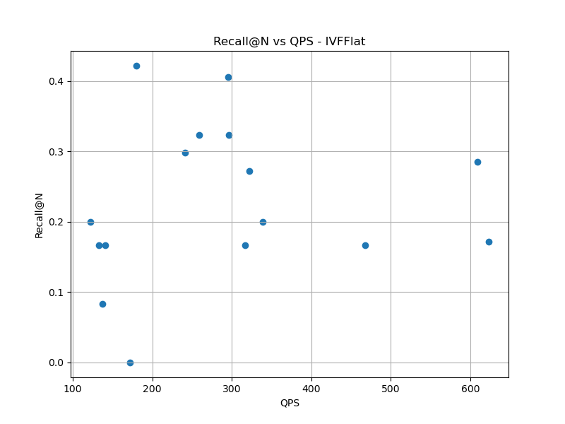
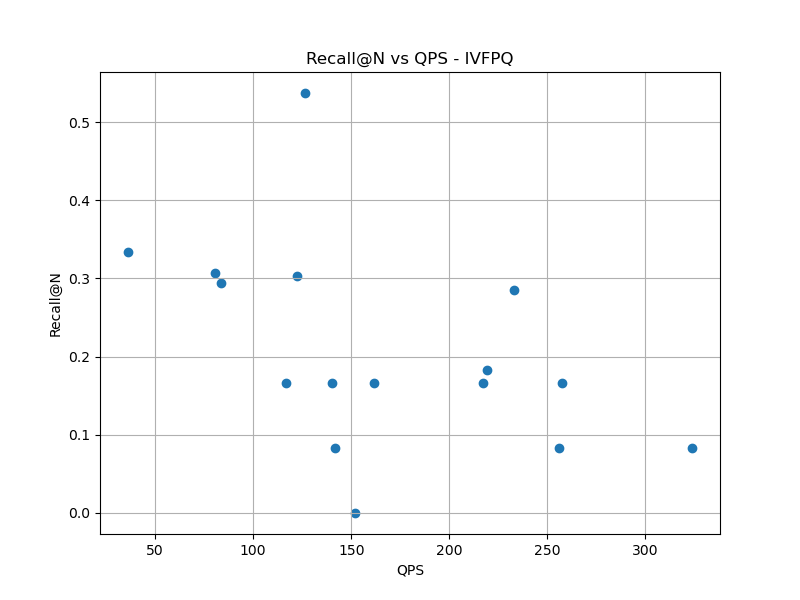
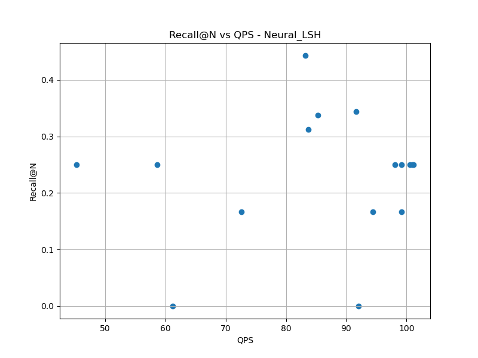

# Ανάπτυξη Λογισμικού για Αλγοριθμικά Προβλήματα

## 3η Εργασία: Αναζήτηση "Απομακρυσμένων" Ομόλογων με Προσεγγιστικές Μεθόδους και ESM-2

#### Αλατζάς Αλέξανδρος - 1115201900005

#### Σκλιάμης Ιωάννης - 1115201700141

Τα αποτελέσματα αντλούνται από το αρχεία στον κατάλογο experiments, όπου έχουμε καταγράψει τις πειραματικές δοκιμές μας.

## 1. Εισαγωγή και Θεωρητικό Πλαίσιο

### 1.1. Το πρόβλημα της Απομακρυσμένης Ομολογίας (Twilight Zone)

Δύο πρωτεΐνες ονομάζονται **ομόλογες** όταν προέρχονται από κοινό εξελικτικό πρόγονο. Δύο ομόλογες πρωτεΐνες έχουν συνήθως παρόμοια τρισδιάστατη δομή, καθώς και παρόμοια βιολογική λειτουργία. Σήμερα έχουμε εκατομμύρια αλληλουχίες πρωτεϊνών, αλλά γνωρίζουμε τη βιολογική λειτουργία μόνο ενός μικρού ποσοστού αυτών. Επομένως, το βασικό μας πρόβλημα είναι μόλις βρούμε μια νέα πρωτεΐνη, πώς καταλαβαίνουμε τι κάνει; Η λύση είναι να βρούμε ότι είναι ομόλογη με μια ήδη γνωστή πρωτεΐνη και άρα τελικά να βγάλουμε συμπεράσματα για τη λειτουργία της. Γι’ αυτό θέλουμε να τις οργανώνουμε σε οικογένιες (pfam), υπεροικογένειες (supfam) και δομικές κατηγορίες (folds). Το BLAST είναι ένα κλασικό εργαλείο στοίχισης αλληλουχιών. Το BLAST παίρνει μία πρωτεΐνη (query) και τη συγκρίνει με μια βάση δεδομένων. Έπειτα, βρίσκει πρωτεΐνες με παρόμοια τμήματα και μας δίνει ένα identity score (πόσα αμινοξέα είναι ίδια) και ένα e-value (πιθανότητα η ομοιότητα να είναι τυχαία), εκτός των άλλων. Αν το identity score είναι υψηλό (μεγαλύτερο από 30%), τότε είναι σχεδόν βέβαιο ότι είναι ομόλογες. Εδώ, ωστόσο, έγκειται ένα πρόβλημα: όταν δύο πρωτεΐνες (το query με μία από τη βάση πρωτεϊνών μας) έχουν 20%-30% identity score, τότε βρίσκονται στο twilight zone. Αυτό σημαίνει ότι δεν είμαστε σε θέση να βγάλουμε ασφαλή συμπεράσματα, καθώς οι δύο αυτές πρωτεΐνες μπορεί να είναι πραγματικά ομόλογες, ή για να είμαστε πιο ακριβείς **απομακρυσμένες ομόλογες**, δηλαδή πρωτεΐνες που ενώ προέρχονται από κοινό εξελικτικό πρόγονο έχουν αλλάξει τόσο πολύ με το χρόνο ώστε οι αλληλουχίες τους πλέον να μοιάζουν ελάχιστα, ή να μοιάζουν τυχαία. Το BLAST, δηλαδή, αποτυγχάνει σε αυτή την περίπτωση.

### 1.2. Σκοπός της Εργασίας

Όπως είδαμε, τα παραδοσιακά εργαλεία στοίχισης ακολουθιών, όπως το BLAST, αδυνατούν συχνά να ανιχνεύσουν απομακρυσμένες ομόλογες πρωτεΐνες, δηλαδή πρωτεΐνες που διατηρούν την τρισδιάστατη δομή τους και τη βιολογική λειτουργία τους, αλλά έχουν χαμηλή ομοιότητα αλληλουχίας (twilight zone). Σκοπός της εν λόγω εργασίας είναι η χρήση διανυσματικών αναπαραστάσεων (embeddings) πρωτεϊνών με τη χρήση του μοντέλου ESM-2 και η εφαρμογή αλγορίθμων Approximate Nearest Neighbor (ANN) για τον εντοπισμό απομακρυσμένων ομόλογων. Ως μέθοδοι αναζήτησης (ANN) χρησιμοποιούμε τις μεθόδους που ήδη έχουμε υλοποιήσει (LSH, Hypercube, IVFFlat, IVFPQ, Neural LSH).

## 2. Μεθοδολογία (Pipeline)

### 2.1. Διαδικασία παραγωγής εμβυθίσεων (Layer 6, Mean Pooling)

Αρχικά, θέλουμε να μετατρέψουμε τις πρωτεΐνες που μας δώθηκαν (50 χιλιάδες απο τη βάση πρωτεϊνών swissprot) σε vectors (embeddings). Μας έχει δωθεί ήδη, για κάθε μία από αυτές τις πρωτεΐνες, η πρωτεϊνική αλληλουχία ως string από αμινοξέα (κάθε γράμμα αντιπροσωπεύει ένα αμινοξύ). Οι αλληλουχίες, λοιπόν, αυτές περνάνε μέσα από το προεκπαιδευμένο μοντέλο ESM-2. Το μοντέλο έχει πολλαπλά layers (π.χ. 33 layers για το μεγαλύτερο ESM-2). Στην εργασία αυτή χρησιμοποιούμε το ESM-2 t6_8M_UR50D, δηλαδή το ESM-2 που αποτελείται από 6 layers (το μικρότερο και ελαφρύτερο τις οικογένειας, με 8 million παραμέτρους). Επιλέγουμε τις εξόδους του layer 6 (δηλαδή του τελευταίου layer, γιατί θέλουμε πιο εξειδικευμένη αναπαράσταση, σε σχέση με το να επιλέγαμε κάποιο από τα προηγούμενα layers) για κάθε αμινοξύ κάθε ακολουθίας. Κάθε αμινοξύ αντιπροσωπεύεται από ένα vector 320 διαστάσεων (d = 320 είναι η ακριβής διάσταση του ESM-2 μοντέλου που χρησιμοποιήσαμε, στο 6ο layer του). Στη συνέχεια, κάνουμε χρήση της τεχνικής mean pooling, δηλαδή υπολογίζουμε τη μέση τιμή όλων των vectors των αμινοξέων, και το αποτέλεσμα είναι ένα μονοδιάστατο vector 320 διαστάσεων που αναπαριστά κάθε μία από τις πρωτεΐνες που μας δόθηκαν. Η παραπάνω διαδικασία επαναλαμβάνεται και για τα query proteins, πριν ακριβώς από τη φάση του search (δηλαδή στο protein_search.py, πριν την χρήση των ANN μεθόδων).

### 2.2. Συνοπτική περιγραφή των μεθόδων ANN που χρησιμοποιήθηκαν

#### LSH

Για την υλοποίηση του αλγορίθμου είναι υπεύθυνη η κλάση LSH, ορισμένη στο LSH.hpp και υλοποιημένη στο LSH.cpp. Αρχικά ορίζουμε τις hash functions, όπου κάθε μία είναι μια τυχαία προβολή σύμφωνα με τον τύπο . Οι `k` hash functions ομαδοποιούνται σε groups `g` και επαναλαμβάνουμε για `L` hash tables. Το κάθε σημείο εισέρχεται στο hash table χρησιμοποιώντας ως index την `g` και οι κουβάδες αποθηκεύουν τις εγγραφές ως `BucketEntry`, δηλαδή ζευγάρια `{idx, ID}` όπου το ID είναι το αντίστοιχο ID για την `g` και το idx είναι το id του διανύσματος (του embedding).  
Για κάθε query, υπολογίζουμε την hash value για να βρούμε τους κουβάδες που ανήκει και από εκεί συλλέγουμε υποψήφιους γείτονες (χρησιμοποιώντας το quering trick από τις διαφάνειες). Αφαιρούμε διπλότυπα και υπολογίζουμε τις αποστάσεις των υποψηφίων γειτόνων με βάση την μετρική που δόθηκε (π.χ. L2). Μετά από ταξινόμηση, οι κοντινότεροι υποψήφιοι ορίζονται ως οι προσεγγιστικά (approximate) κοντινότεροι γείτονες.

#### Hypercube

Για την υλοποίηση του αλγορίθμου είναι υπεύθυνη η κλάση Hypercube, ορισμένη στο Hypercube.hpp και υλοποιημένη στο Hypercube.cpp. Αρχικά ορίζουμε `kproj` τυχαίες προβολές, σύμφωνα με τον τύπο  και τα τυχαία offset. Έπειτα, χτίζουμε τη δομή του υπερκύβου, όπου αφού υπολογίσουμε τις hash values, τις αντιστοιχίζουμε με ένα τυχαίο bit. Συνδυάζουμε τα bits σε ένα ID των `kproj` bits και αποθηκεύουμε αυτό το index στον κύβο. Αντίστοιχα, η συνάρτηση `computeVertex` υπολογίζει τους binary κωδικούς για κάθε query και επιστρέφει την κορυφή του κύβου. Στην `getProbeVertices` καθορίζουμε ποιές κορυφές θα εξεταστούν στην αναζήτηση και επιστρέφεται η λίστα με τα ID (binary κωδικοί) του υπερκύβου που βρίσκονται εντός συγκεκριμένης Hamming απόστασης. Με την `prev_permutations` φτιάχνουμε όλους τους πιθανούς συνδυασμούς από bits που μπορούν να γίνουν flip για τη συγκεκριμένη απόσταση και κάνουμε flip το `i`-οστό bit από τον κωδικό του query. Αυτή η κορυφή προστίθεται στις κορυφές που θα γίνουν probe, έτσι ώστε να εξετάσουμε όλες τις πιθανές κοντινές κορυφές. Για την αναζήτηση, αντιστοιχίζουμε το κάθε query στην κορυφή του κύβου που ανήκει και για κάθε γειτονική κορυφή, αν αυτή υπάρχει στον κύβο, παίρνουμε τα σημεία και τα ορίζουμε ως υποψήφια. Αν υπερβούμε την παράμετρο `M`, σταματάμε νωρίς. Αφού συλλέξουμε τους υποψήφιους γείτονες, ταξινομούμε και συλλέγουμε τους προσεγγιστικά (approximate) κοντινότερους γείτονες.

#### kMeans

Για την υλοποίση του αλγορίθμου υπεύθυνη είναι η κλάση IVFBase (parent class των IVFFlat και IVFPQ), ορισμένη στο ivfbase.hpp και υλοποιημένη στο ivfbase.cpp. Αρχικά, η IVFBase έχει συναρτήσεις μέλη τις `centerInitialization` και `LloydsAlgorithm`. Η `centerInitialization` χρησιμοποιεί την τακτική kmeans++ με σκοπό να κάνει initialize τα κεντροειδή. Πιο συγκεκριμένα, επιλέγεται τυχαία (σύμφωνα με μια ομοιόμορφη κατανομή) ένα από τα embeddings (συγκεκριμένα το id του, δηλαδή η θέση του στο αρχείο), το οποίο και θεωρείται κεντροειδές. Έπειτα, υπάρχει ένα loop, στο οποίο βρίσκουμε την απόσταση όλων των embeddings από τα κεντροειδή (στο πρώτο loop έχουμε μονάχα ένα κεντροειδές, οπότε βρίσκουμε την απόσταση όλων των υπόλοιπων embeddings από τo embedding εκείνο που αποτελεί το κεντροειδές μας) και στη συνέχεια επιλέγουμε τυχαίο κεντροειδές t μέσω ομοιόμορφης κατανομής. Τρέχουμε το παραπάνω loop μέχρι να βρεθούν kclusters κεντροειδή. Η `LloydsAlgorithm`, από την άλλη, καλεί την `centerInitialization` και στη συνέχεια χρησιμοποιεί τον αλγόριθμο του Lloyd (ως max iter έχουμε θέσει το 50) αναθέτοντας τα embeddings στο πιο κοντινό τους κεντροειδές και κάνοντας update τα κεντροειδή (βρίσκοντας τη μέση τιμή κάθε cluster και συνεχίζοντας έως ότου φτάσουμε τα max iter ή φτάσουμε σε σημείο που τα κεντροειδή δεν ανενεώνονται)

#### IVFFlat

Για την υλοποίηση του αλγορίθμου είναι υπεύθυνη η κλάση IVFFlat (παιδί της κλάσης IVFBase), ορισμένη στο ivfflat.hpp και υλοποιημένη στο ivfflat.cpp. Η `buildIVFFlat` είναι μέθοδος της κλάσης IVFFlat και καλεί την `centerInitialization` για ένα subset του dataset (μεγέθους ίσο με τη ρίζα του μεγέθους του dataset). Έπειτα, αντιστοιχεί τα υπόλοιπα embeddings στα clusters που έχουν δημιουργηθεί (αναθέτει το κάθε embedding στο cluster του οποίου το centroid έχει τη μικρότερη απόσταση από αυτό). Όσον αφορά την μέθοδο `IVFFlatQuery`, ουσιαστικά για κάθε embedding του query set βρίσκει την l2-απόσταση από τα κεντροειδή των clusters που έχουν δημιουργηθεί και για τα πιο κοντινά nprobe κεντροειδή (και κατ' επέκταση clusters) βρίσκει την l2-απόσταση του query embedding από τα embeddings που ανήκουν σε αυτά τα clusters. Τελικά, χρησιμοποιεί την sort() και γυρνάει τις N μικρότερες από αυτές αποστάσεις (οι οποίες αντιστοιχούν στους N nearest neighbors).

#### IVFPQ

Για την υλοποίηση του αλγορίθμου είναι υπεύθυνη η κλάση IVFPQ (παιδί της κλάσης IVFBase), ορισμένη στο ivfpq.hpp και υλοποιημένη στο ivfpq.cpp. Η `buildIVFPQ` είναι μέθοδος της κλάσης IVFPQ και καλεί την `centerInitialization` για ένα subset του dataset (μεγέθους ίσο με τη ρίζα του μεγέθους του dataset). Έπειτα, αντιστοιχεί τα υπόλοιπα embeddings στα clusters που έχουν δημιουργηθεί (αναθέτει το κάθε embedding στο cluster του οποίου το centroid έχει τη μικρότερη απόσταση από αυτό). Στη συνέχεια, για κάθε embedding βρίσκει το residual vector του, όπου residual = embedding's_vector - cluster's_centroid's_vector, δηλαδή τη διαφορά του embedding με το κεντροειδούς του cluster στο οποίο ανήκει το εκάστοτε embedding. Για M subspaces, κόβει το residual του κάθε embedding σε M μέρη (μεγέθους dim_of_images / M το καθένα) και για κάθε subspace από τα M δημιουργεί καινουργιο object της κλάσης Dataset (έστω mth_subvectors_set) από τα m-subvectors του κάθε embedding (όπου m ακέραιος με 0 < m < M) και καλεί τις συναρτήσεις της IVFBase για συσταδοποίηση σε αυτό το subspace με 2^nbits κεντροειδή στον κάθε υποχώρο. Τέλος, δημιουργεί έναν vector<vector> codebook[M][2^nbits] με τις τιμές των κεντροειδών όλων των subspaces. Η μέθοδος `IVFPQQuery` για κάθε embedding του query set βρίσκει τα nprobe πιο κοντινά clusters (με χρήση l2-απόστασης) και στη συνέχεια για καθένα από αυτά τα clusters βρίσκει το residual σε σχέση με το κεντροειδές του cluster, καθώς και κόβει το residual αυτό σε M κομμάτια. Έπειτα, δημιουργεί το lookup-table του query embedding για το εν λόγω cluster βρίσκοντας τις l2-αποστάσεις του εκάστοτε m subvector του residual του με όλα τα κεντροειδή των M υποχώρων (δηλαδή lookup-table[m][k] = l2-distance( query's_mth_subvector, kth_centroid_of_m_subspace )). Τελικά, για κάθε embedding (έστω candidate), το οποίο ανήκει στο cluster, βρίσκει την approximate distance του από το query embedding προσθέτοντας της απόστασης των query subvectors με το κεντροειδές του υποχώρου στο οποίο ανήκουν οι subvectors του candidate (με απλά λόγια κοιτάει σε πια clusters των M υποχώρων ανήκουν τα subvectors του candidate και προσθέτει της αποστάσης των κεντροειδών τους με τους subvectors του query). Η μέθοδος επαναλαμβάνει την παραπάνω διαδικασία για κάθε nprobe cluster του query embedding.

#### Neural LSH

##### IVFFlat (1ης εργασίας)

Από τα πειράματα της 1ης εργασίας, την καλύτερη επίδοση βάσει ακρίβειας και χρόνου σημείωσε ο αλγόριθμος IVFFlat, συνεπώς τον χρησιμοποιούμε για την δημιουργία του KNN γράφου. Για να ελλατώσουμε τον χρόνο εκτέλεσης, υλοποιήσαμε την συνάρτηση `IVFFlatQueryGraph`, η οποία εκτελεί τον αλγόριθμο χωρίς να κρατάει μετρικές, σημειώνοντας δηλαδή μόνο προσεγγιστικούς γείτονες και αποστάσεις. Μέσω της βιβλιοθήκης subprocess μεταγλωττίζουμε τον κώδικα της 1ης εργασίας και εκτελούμε τον αλγόριθμο ivfflat με τις βέλτιστες παραμέτρους που επιλέξαμε. Για την κατασκευή του γράφου δίνουμε ως query όλο το dataset. Το αρχείο εξόδου αποθηκεύεται στο `index path` που έδωσε ο χρήστης στο `nlsh_build`.

##### graph_builder.py

`parse_knn_file()`: Διαβάζουμε το δομημένο αρχείο εξόδου του ivfflat και χρησιμοποιώντας regular expressions διαβάζουμε και αποθηκεύουμε τους πλησιέστερους γείτονες για κάθε query. `build_weighted_graph()`: Για την κατασκευή του μη κατευθυνόμενου γράφου, ακολουθούμε την μέθοδο από τις διαφάνειες, όπου αναθέτουμε βάρος 2 σε αμοιβαίους γείτονες και βάρος 1 σε μονόπλευρους. Αρχικοποιούμε όλες τις ακμές με 1 για να επιβεβαιώσουμε ότι κάθε γείτονας θα υπάρχει στον γράφο και έπειτα ενημερώνουμε τα βάρη των αμοιβαίων με 2.  `create_kahip_format()`: Αφού έχουμε τον γράφο, τον μετατρέπουμε σε μορφή CSR. Στον πίνακα `xadj` αποθηκεύουμε τα degrees των κόμβων. Χρησιμεύει ως δείκτης που κρατάει τη θέση των γειτόνων κάθε κόμβου μέσα στους πίνακες `adjncy` και `adjcwgt`. Δηλαδή, για να βρούμε τους γείτονες του κόμβου i, κοιτάζουμε τις θέσεις `xadj[i]` έως `xadj[i+1]`. Στον πίνακα `adjncy` έχουμε τα IDs των γειτόνων σε σειρά. Στον πίνακα `adjcwgt` έχουμε τα βάρη των αντίστοιχων ακμών του γράφου, με τις τιμές να αντιστοιχούν μία προς μία στις τιμές του πίνακα `adjncy`. Τέλος, στον πίνακα `vwgt` έχουμε τα βάρη των κόμβων, όπου αναθέτουμε βάρος ίσο με 1 σε όλους τους κόμβους.

##### feedforward_nn.py

Έχουμε δημιουργήσει ένα απλό feed forward νευρωνικό δίκτυο που χρησιμοποιούμε ως classifier. Αποτελείται από γραμμικά layers με νευρώνες. Εφαρμόζουμε `ReLu` activation function σε αυτό που παράγει ο κάθε νευρώνας του δικτύου μας (δηλαδή για κάθε νευρώνα κάνουμε ReLu(Sum(weights))). Επιπλέον, σε κάθε layer έχουμε προσθέσει `dropout` ίσο με 0.2, μετά από κάθε layer δηλαδή το 20% των weights μηδενίζονται (τυχαία). Αυτό βοηθά το μοντελό μας να γενικεύει καλύτερα.

##### train.py

Η συνάρτηση αυτή αποτελεί, ουσιαστικά, το `training loop` του μοντέλου μας. Σε κάθε εποχή feedάρουμε το μοντέλο μας με τα embeddings του training dataset (σε `batches`), το μοντέλο μας κάνει κάποιες προβλέψεις (αρχικά, προφανώς θα είναι κακές) και βρίσκουμε πόσο λάθος κάνει με χρήση του loss function που έχουμε επιλέξει (`CrossEntropyLoss` στην περίπτωσή μας). Έπειτα, μέσω του optimizer `Adam` ενημερώνουμε τα βάρη (weights) του νευρικού μας δικτύου κατάλληλα. Επαναλαμβάνουμε την διαδικασία αυτή για κάθε εποχή. Στο τέλος κάθε εποχής χρησιμοποιούμε το validation dataset που έχουμε φτιάξει για να υπολογίσουμε κάποιες μετρικές για το μοντέλο μας, πιο συγκεκριμένα accuracy, f1_score και precision. Τελικά, αφού τελειώσει το training loop για όλες τις εποχές, αποθηκεύουμε το μοντέλο μας (δηλαδή τα βάρη του) και φτιάχνουμε γραφικές παραστάσεις για το accuracy στο training και στο validation dataset, καθώς και για το loss στο training και στο validation dataset, σε σχέση με τις εποχές, για να είμαστε σίγουροι ότι το μοντέλο μας δεν κάνει `overfit`.

##### nlsh_build.py

Ξεκινώντας, γίνεται διάβασμα και επαλήθευση των παραμέτρων από την γραμμή εντολών. Εκτελείται ο αλγόριθμος ivfflat της 1ης εργασίας για την παραγωγή του αρχείου εξόδου. Αυτό το αρχείο αποθηκεύεται στο `index path` που έδωσε ο χρήστης. Από εκεί, το διαβάζουμε και κατασκευάζουμε τον knn γράφο. Κατόπιν, τον μετατρέπουμε σε μη κατευθυνόμενο και μετά χρησιμοποιώντας τη βιβλιοθήκη kahip κατασκευάζουμε την ισοκατανεμημένη διαμέρισή του. Δημιουργούμε το ευρετήριο, στο οποίο καταγράφονται οι ετικέτες της διαμέρισης, με τα αντίστοιχα σημεία που ανήκουν σε αυτές και το αποθηκεύουμε στο `index path` σε μορφή json.  
Στη συνέχεια, χωρίζουμε τα δεδομένα σε 80% training και 20% validation και κατασκευάζουμε τα αντίστοιχα `DataLoader` objects. Το training ανακατεύει τα δεδομένα, ενώ το validation όχι.  
Αρχικοποιούμε το νευρωνικό δίκτυο βάσει των παραμέτρων και αποθηκεύουμε τις παραμέτρους σε ξεχωριστό αρχείο json, επίσης στο `index path`.  
Τέλος, χρησιμοποιούμε Adam optimizer με L2 weight decay, ορίζουμε την Cross-entropy loss function και εκπαιδεύουμε το μοντέλο.

##### nlsh_search.py

Αρχικά, γίνεται διάβασμα και επαλήθευση των παραμέτρων από τη γραμμή εντολών. Έπειτα, αρχικοποιούμε το νευρικό δίκτυο, σύμφωνα με τις παραμέτρους που έχουμε αποθηκεύσει στο αρχείο `index path/model_params.json` και φορτώνουμε τα βάρη (weights) του ήδη εκπαιδευμένου μοντέλου. Διαβάζουμε το query dataset και κατασκευάζουμε το αντίστοιχο `DataLoader`. Στη συνέχεια, feedαρουμε τα queries μέσα στο μοντέλο μας (with `torch.no_grad()`) και στα logits τα οποία παράγονται για κάθε query embedding εφαρμόζουμε `softmax`, έτσι ώστε να πάρουμε τις πιθανότητες να βρίσκεται το εκάστοτε query embedding σε καθένα από τα μέρη της διαμέρισης του γράφου. Τέλος, για κάθε query embedding κρατάμε τις T μεγαλύτερες πιθανότητες και κοιτάμε στα αντίστοιχα μέρη του γράφου, δηλαδή βρίσκουμε την ευκλείδια απόσταση του query embedding από κάθε embedding που βρίσκεται σε αυτά τα T μέρη και κρατάμε τους k πιο κοντινούς γείτονες από αυτά.

### 2.3. Περιγραφή Δεδομένων (SwissProt, Queries, Ground Truth).

#### Βάση δεδομένων SwissProt

Το SwissProt είναι μια χειροκίνητα επιμελημένη (curated) βάση δεδομένων πρωτεϊνών. Περιέχει πρωτεΐνες από διάφορους οργανισμούς με αξιόπιστη λειτουργική και δομική πληροφορία. Κάθε εγγραφή περιλαμβάνει: αλληλουχία πρωτεΐνης, ονομασία και λειτουργία, ομόλογες πρωτεΐνες, GO terms, pfam domains, supfam domains και άλλες δομικές και λειτουργικές πληροφορίες. Το input dataset, λοιπόν, που μας δόθηκε ήταν 50 χιλιάδες πρωτεΐνες που υπάρχουν στη βάση αυτή (τα id τους, καθώς και η αλληλουχία των αμινοξέων τους ως string). Μπορούν να βρεθούν στο αρχείο `swissprot_50k.fasta`.

#### Queries

Σαν query dataset μας δόθηκαν 12 επιλεγμένες πρωτεΐνες, πάλι από τη βάση SwissProt (τα id τους, καθώς και η αλληλουχία των αμινοξέων τους ως string). Μπορούν να βρεθούν στο αρχείο `targets.fasta`.

#### Ground Truths

Για την αξιολόγηση των μεθόδων αναζήτησης ομόλογων πρωτεϊνών (ANN με ESM-2 embeddings), χρειαζόμαστε σημεία αναφοράς (ground truths). Ως πραγματικά ομόλογα θεωρούμε τα BLAST hits (χρησιμοποιούμε σαν `threshold identity score >=30%` και `e-value < 1e-3`). Έτσι, κάθε query πρωτεΐνη έχει μια λίστα πραγματικών γειτόνων (σαν τέτοιους τους θεωρούμε) και οι γείτονες αυτοί αποτελούν το ground truth για τη μέτρηση του recall@N.  Μετράμε, επομένως, πόσο καλά ο εκάστοτε αλγόριθμος βρίσκει τα σωστά BLAST hits.

## 3. Πειραματικά Αποτελέσματα

### 3.1. Πίνακες και γραφήματα απόδοσης (Recall@N & QPS)

### 3.2. Ανάλυση του trade-off μεταξύ Ακρίβειας και Ταχύτητας

#### Eucleidian LSH

**Recall@N**: Υψηλό  
**QPS**: Πολύ χαμηλό  
**Trade off**: Σε γενικές γραμμές όσο αυξάνουμε το k, δηλαδή το πλήθος συναρτήσεις κατακερματισμού, τόσο πιο accurate γίνεται το hashing, επομένως αυξάνεται το recall, αλλά πέφτει το qps. Επιπλέον, όσο αυξάνουμε την παράμετρο L, τόσο αυξάνεται το recall, όμως έχουμε πτώση του qps.

#### Hypercube

**Recall@N**: Χαμηλό  
**QPS**: Πάρα πολύ υψηλό  
**Trade off**: Γενικά όσο αυξάνουμε το k_proj η αναζήτηση φτάνει σε πιο αυστηρώς επιλεγμένα κελιά, θυσιάζοντας την απόδοση. Αντίστοιχα, αυξάνοντας probes και M επισκεπτόμαστε περισσότερους υποψήφιους γείτονες, συνεπώς αυξάνεται και το recall όμως παρατηρείται πτώση του qps.

#### IVFFlat

**Recall@N**: Υψηλό  
**QPS**: Υψηλό  
**Trade off**: Όσο πιο πολύ αυξάνουμε το nprobe, σε σχέση με το kclusters, τόσο πιο πολύ αυξάνεται το recall και μειώνεται το qps. Παρατηρήθηκε, επίσης, ότι χρειαζόμαστε αρκετά μεγάλο αριθμό από kclusters για να έχουμε ικανοποιητικό recall.

#### IVFPQ

**Recall@N**: Μέτριο - Πολύ Υψηλό (υπάρχει αρκετά μεγάλη απόκληση)  
**QPS**: Μέτριο - Υψηλό (υπάρχει αρκετά μεγάλη απόκληση)  
**Trade off**: Όσο πιο πολύ αυξάνουμε το nprobe, σε σχέση με το kclusters, τόσο πιο πολύ αυξάνεται το recall και μειώνεται το qps. Παρατηρήθηκε, επίσης, ότι χρειαζόμαστε αρκετά μεγάλο αριθμό από kclusters για να έχουμε ικανοποιητικό recall. Από τη φύση του είναι πολύ γρήγορος αλγόριθμος, καθώς δεν χραιάζεται να υπολογίσουμε ευκλείδιες αποστάσεις. Όσο αυξάνουμε το M (subspaces) και το nbits, τόσο αυξάνεται και το recall.

#### Neural LSH

**Recall@N**: Υψηλό  
**QPS**: Χαμηλό  
**Trade off**: Γενικά είναι αρκετά αργός αλγόριθμος από τη φύση του, ωστόσο, δεδομένου ότι έχουμε κάνει σωστό fine tuning των υπερπαραμέτρων, είναι και ο πιο σταθερός, αφού σπάνια έχουμε πτώση του recall. Σε γενικές γραμμές, όσο πιο περίπλοκη είναι η αρχιτεκτονική του classifier μας (layers, nodes per layer) τόσο πιο αργός είναι (άρα χαμηλό qps). Επιπλέον, όσο μεγαλύτερο είναι το  T σε σχέση με το m, τόσο μεγαλύτερο recall έχουμε, ενώ παρατηρείται πτώση του qps.

### 3.3. Σύγκριση μεταξύ των ANN αλγορίθμων

Θεωρητικά θα περιμέναμε ότι οι αλγόριθμοι ivfflat και neural lsh τα ήταν οι πιο αποτελεσματικοί. Κάτι τέτοιο ισχύει, ωστόσο παρατηρήθηκε επίσης, ότι ο lsh καταφέρνει να τους συναγωνιστεί ως προς το recall, με αρκετά μικρότερο qps βέβαια, ειδικά σε σχέση με τον ivfflat, ο οποίος και σε σε αυτήν την εργασία παραμένει ο πιο γρήγορος από αυτούς τους 3 αλγορίθμους. Εντύπωση έκανε, το γεγονός ότι ο lsh καταφέρνει, για μικρά N (neighbors), να είναι, έστω και με μικρές διαφορές, ο πιο αποτελεσματικός (μαζί με τον neural lsh, για συγκεκριμένους παραμέτρους), ως προς το recall. Όσον αφορά τον hypercube, είναι αρκετά πιο γρήγορος από τους υπόλοιπους, ωστόσο παραμένει και ο πιο αναποτελεσματικός. Βέβαια, εδώ θα πρέπει να αναφέρουμε ότι ο hypercube, για κάποια συγκεκριμένα queries, είναι ο πιο αποτελεσματικός αλγόριθμος, πετυχαίνοντας αρκετά υψηλότερο recall σε σχέση με τους υπόλοιπους. Τέλος, για τον ivfpq ισχύουν περίπου τα ίδια με τον hypercube. Πιο συγκεκριμένα, είναι πολύ αποτελεσματικός για κάποια queries, ενώ δυσκολεύεται σημαντικά για άλλα. Τρομερή εντύπωση έκανε το γεγονός, ωστόσο, ότι ο ivfpq για εύρεση πολλών γειτόνων (200) είναι ο πιο αποτελεσματικός, με βάση το recall, αφού πετυχαίνει πολύ υψηλότερο από οποιονδήποτε άλλο αλγόριθμο (οι υπόλοιποι κυμαίνται μεταξύ 0.35-0.45 για recall@200, ενώ ο ivfpq πετυχαίνει 0.54). Συμπερασματικά, μπορούμε να δούμε, έχοντας υπόψη και τα γραφήματα που δείξαμε στην ενότητα 3.1, ότι δεν υπάρχει μεγάλη διαφορά, όσον αφορά την αποτελεσματικότητα, μεταξύ των αλγορίθμων και σε γενικές γραμμές δεν ξεχώριζει κάποιος από αυτούς (αναφέραμε πολύ ειδικές περιπτώσεις που όντως υπάρχει κάποιος που ξεχωρίζει). Η μικρές διαφόρες στο recall είναι κυρίως λόγω των τεχνικών που χρησιμοποιούμε για να βρούμε τους approximate neighbors και όχι λόγω των embeddings. Θεωρούμε, λοιπόν, ότι είναι πάνω στην ευχέρεια του χρήστη για το ποιον αλγόριθμο θα χρησιμοποιήσει, ανάλογα με το τι ακριβώς τον ενδιαφέρει να επιτύχει (μεγαλύτερο recall ή qps), δίνοντας ως επιλογή μας είτε τον neural lsh ή τον ivfflat, με τον neural lsh να είναι λίγο πιο αποδοτικός και πιο σταθερός, αλλά σημαντικά πιο αργός από τον ivfflat.

## 4. Ποιοτική/Βιολογική Αξιολόγηση

### 4.1. Κριτήρια Ταυτοποίησης

#### Απομακρυσμένες Ομόλογες Πρωτεΐνες

Ως `απομακρυσμένες ομόλογες` πρωτεΐνες ορίζουμε τις πρωτεΐνες εκείνες οι οποίες έχουν χαμηλό BLAST identity score (ανήκουν στο twilight zone, δηλαδή 20-30% identity score), αλλά έχουν παρόμοια βιολογική λειτουργία, βρίσκονται στην ίδια οικογένεια ή υπεροικογένεια (pfam και supfam αντίστοιχα), έχουν ίδιο ec number (αν υπάρχει, δηλαδή όταν πρόκειται για ένζυμα), καθώς και ίδια GO terms, και είμαστε σε θέση να τις βρούμε με χρήση ESM-2 embeddings και ANN search.

#### Ψευδώς Θετικά Αποτελέσματα

Αν δύο πρωτεΐνες (το query και άλλη μία από τη βάση μας, έστω approximate neighbor) έχουν χαμηλό BLAST identity score (ανήκουν στο twilight zone, δηλαδή 20-30% identity score), αλλά τα embeddings τους είναι κοντινά μεταξύ τους (ANN με τη χρήση των αλγορίθμων που έχουμε υλοποιήσει), τότε ανατρέχουμε στη βάση πρωτεϊνών SwissProt, με σκοπό να αντλήσουμε πληροφορίες σχετικά με τη βιολογική λειτουργία τους, καθώς και τις οικογένειες στις οποίες ανήκουν. Σε περίπτωση που βρούμε ότι δεν έχουν παρόμοια λειτουγία και δεν έχουν κοινά χαρακτηριστικά (pfams, supfams, ec number, GO terms, folds), τότε θεωρούμε τον εν λόγω approximate neighbor ως `ψευδώς θετικό αποτέλεσμα`.

### 4.2. Αναλυτική Παρουσίαση Χαρακτηριστικών Περιπτώσεων - Επιτυχίες ESM-2 Embeddings έναντι BLAST

#### Παράδειγμα 1

Για την query πρωτεΐνη με id `A0A009I3Y5`, όλες οι μέθοδοι αναζήτησης ANN, με εξαίρεση την μέθοδο IVFPQ, ανέδειξαν την πρωτεΐνη με id `sp|P33800|PG187_VAR67` ως έναν από τους 15 πλησιέστερους γείτονες (ο 15ος γείτονας). Ωστόσο, η σύγκριση με BLAST μεταξύ των δύο αυτών πρωτεϊνών έδωσε ποσοστό ταύτισης αλληλουχίας (identity score) στο twilight zone (πιο συγκεκριμένα είχαν identity score 26.136%). Στη συνέχεια, η σχέση των δύο αυτών πρωτεϊνών επιβεβαιώθηκε μέσω της βάσης δεδομένων SwissProt, όπου επαληθεύτηκε ότι οι δύο αυτές πρωτεΐνες έχουν παρόμοια βιολογική λειτουργία, καθώς ανήκουν στην ίδια κατηγορία **κινασών**, δηλαδή ενζύμων που καταλύουν τη φωσφορυλίωση άλλων πρωτεϊνών, ανήκουν στην ίδια pfam (PF00069) και στην ίδια supfam (SSF56112), έχουν τον ίδιο ec αριθμό (2.7.11.1) και έχουν τους εξής GO terms ίδιους: 0000166, 0004672, 0004674, 0005524, 0016301, 0016740. Σύμφωνα, λοιπόν, με τα παραπάνω επιβεβαιώθηκε ότι αποτελούν απομακρυσμένες ομόλογες (remote homologs).

#### Παράδειγμα 2

Για την query πρωτεΐνη με id `A0A001`, όλες οι μέθοδοι ανέδειξαν την πρωτεΐνη με id `sp|P9WQJ3|FATRP_MYCTU` ως τον top 1 γείτονα. Ωστόσο, η σύγκριση με BLAST μεταξύ των δύο αυτών πρωτεϊνών έδωσε ποσοστό ταύτισης αλληλουχίας (identity score) στο twilight zone (πιο συγκεκριμένα είχαν identity score 25.309%). Στη συνέχεια, η σχέση των δύο αυτών πρωτεϊνών επιβεβαιώθηκε μέσω της βάσης δεδομένων SwissProt, όπου επαληθεύτηκε ότι οι δύο αυτές πρωτεΐνες έχουν παρόμοια βιολογική λειτουργία, καθώς ανήκουν στις ίδιες pfam (PF00664: ABC transporter, PF00005: ABC transporter transmembrane region) και στις ίδιες supfam (SSF90123, SSF52540) και έχουν τους εξής GO terms ίδιους: 0000166, 0005524, 0016887, 0042626, 0140359, 0055085, 0005886, 0016020. Τα παραπάνω μας οδηγούν στο συμπέρασμα ότι και οι δύο αυτές πρωτεΐνες είναι **ABC μεταφορείς** (από τα αρχικά των λέξεων **A**TP-**b**inding **c**assette, που σημαίνει "κασέτα δέσμευσης ATP"), πρωτεΐνες μεταφοράς δηλαδή που χρησιμοποιούν την ενέργεια από την υδρόλυση του ATP για να μετακινήσουν διάφορες ουσίες διαμέσου των κυτταρικών μεμβρανών. Επομένως, επιβεβαιώθηκε ότι αποτελούν απομακρυσμένες ομόλογες (remote homologs).

#### Παράδειγμα 3

Για την query πρωτεΐνη με id `A0A001`, όλες οι μέθοδοι ανέδειξαν την πρωτεΐνη με id `sp|Q20Z38|NDVA_RHOPB` ως τον top 4 γείτονα. Ωστόσο, η σύγκριση με BLAST μεταξύ των δύο αυτών πρωτεϊνών έδωσε ποσοστό ταύτισης αλληλουχίας (identity score) στο twilight zone (πιο συγκεκριμένα είχαν identity score 23.539%). Στη συνέχεια, η σχέση των δύο αυτών πρωτεϊνών επιβεβαιώθηκε μέσω της βάσης δεδομένων SwissProt, όπου επαληθεύτηκε ότι οι δύο αυτές πρωτεΐνες έχουν παρόμοια βιολογική λειτουργία, καθώς ανήκουν στις ίδιες pfam (PF00664: ABC transporter, PF00005: ABC transporter transmembrane region) και στις ίδιες supfam (SSF90123, SSF52540) και έχουν τους εξής GO terms ίδιους: 0000166, 0005524, 0016887, 0042626, 0140359, 0055085, 0005886, 0016020. Τα παραπάνω μας οδηγούν στο συμπέρασμα ότι και οι δύο αυτές πρωτεΐνες είναι **ABC μεταφορείς** (από τα αρχικά των λέξεων **A**TP-**b**inding **c**assette, που σημαίνει "κασέτα δέσμευσης ATP"), πρωτεΐνες μεταφοράς δηλαδή που χρησιμοποιούν την ενέργεια από την υδρόλυση του ATP για να μετακινήσουν διάφορες ουσίες διαμέσου των κυτταρικών μεμβρανών. Επομένως, επιβεβαιώθηκε ότι αποτελούν απομακρυσμένες ομόλογες (remote homologs).

#### Παράδειγμα 4

Για την query πρωτεΐνη με id `A0A009HL96`, όλες οι μέθοδοι ανέδειξαν την πρωτεΐνη με id `sp|Q5HI09|GRAR_STAAC` ως τον top 1 γείτονα. Ωστόσο, η σύγκριση με BLAST μεταξύ των δύο αυτών πρωτεϊνών έδωσε ποσοστό ταύτισης αλληλουχίας (identity score) στο twilight zone (πιο συγκεκριμένα είχαν identity score 26.126%). Στη συνέχεια, η σχέση των δύο αυτών πρωτεϊνών επιβεβαιώθηκε μέσω της βάσης δεδομένων SwissProt, όπου επαληθεύτηκε ότι οι δύο αυτές πρωτεΐνες έχουν παρόμοια βιολογική λειτουργία, καθώς ανήκουν στις ίδιες pfam (PF00664: ABC transporter, PF00005: ABC transporter transmembrane region) και στις ίδιες supfam (PF00072: Response regulator receiver domain, PF00486: Transcriptional regulatory protein, C terminal) και έχουν τους εξής GO terms ίδιους: 0000166, 0005524, 0016887, 0042626, 0140359, 0055085, 0005886, 0016020. Από τα παραπάνω, μπορούμε να καταλάβουμε ότι οι δύο αυτές πρωτεΐνες είναι **ρυθμιστές απόκρισης δύο συστατικών τύπου OmpR/PhoB** (OmpR/PhoB-type two-component response regulators), δηλαδή πρόκειται για παράγοντες μεταγραφής που ανήκουν σε συστήματα σηματοδότησης δύο συστατικών, τα οποία επιτρέπουν στα βακτήρια να αντιλαμβάνονται και να ανταποκρίνονται σε περιβαλλοντικά ερεθίσματα. Επομένως, επιβεβαιώθηκε ότι αποτελούν απομακρυσμένες ομόλογες (remote homologs).

#### Παράδειγμα 5

Για την query πρωτεΐνη με id `A0A010Q3W2`, όλες οι μέθοδοι ΑΝΝ, με εξαίρεση την μέθοδο IVFPQ, ανέδειξαν την πρωτεΐνη με id `sp|O82266|SWA1_ARATH` ως έναν από τους 20 πλησιέστερους γείτονες (ο 16ος γείτονας). Ωστόσο, η σύγκριση με BLAST μεταξύ των δύο αυτών πρωτεϊνών έδωσε ποσοστό ταύτισης αλληλουχίας (identity score) στο twilight zone (πιο συγκεκριμένα είχαν identity score 26.742%). Στη συνέχεια, η σχέση των δύο αυτών πρωτεϊνών επιβεβαιώθηκε μέσω της βάσης δεδομένων SwissProt, όπου επαληθεύτηκε ότι οι δύο αυτές πρωτεΐνες έχουν παρόμοια βιολογική λειτουργία, καθώς ανήκουν στις ίδιες pfam (PF09384: UTP15 C terminal, PF00400: WD domain, G-beta repeat) και στην ίδια supfam (SSF50978) και έχουν τους εξής GO terms ίδιους: 0006364, 0045943, 0005730. Από τα παραπάνω, μπορούμε να καταλάβουμε ότι οι δύο αυτές πρωτεΐνες έχουν παρόμοια βιολογική λειτουργία, σχετικά με τη  **βιογένεση των ριβοσωμάτων** και τη **συναρμολόγηση πυρηνίσκου**. Επομένως, επιβεβαιώθηκε ότι αποτελούν απομακρυσμένες ομόλογες (remote homologs).

#### Παράδειγμα 6

Για την query πρωτεΐνη με id `A0A009HN45`, όλες οι μέθοδοι ανέδειξαν την πρωτεΐνη με id `sp|Q0HMR2|RAPA_SHESM` ως τον top 4-5 γείτονα. Ωστόσο, η σύγκριση με BLAST μεταξύ των δύο αυτών πρωτεϊνών έδωσε ποσοστό ταύτισης αλληλουχίας (identity score) στο twilight zone (πιο συγκεκριμένα είχαν identity score 23.364%). Στη συνέχεια, η σχέση των δύο αυτών πρωτεϊνών επιβεβαιώθηκε μέσω της βάσης δεδομένων SwissProt, όπου επαληθεύτηκε ότι οι δύο αυτές πρωτεΐνες έχουν παρόμοια βιολογική λειτουργία, καθώς ανήκουν στις ίδιες pfam (PF00271: Helicase conserved C-terminal domain, PF00176: SNF2-related domain), βέβαια η sp|Q0HMR2|RAPA_SHESM ανήκει και σε περισσότερες οικογένειες, στην ίδια supfam (SSF52540) και έχουν τους εξής GO terms ίδιους: 0000166, 0004386, 0005524, 0016787. Από τα παραπάνω, μπορούμε να καταλάβουμε ότι οι δύο αυτές πρωτεΐνες έχουν παρόμοια βιολογική λειτουργία, καθώς και δύο είναι **ATP-εξαρτώμενες ελικάσες που συνδέονται με την RNA πολυμεράση** (RNAP) και ρυθμίζουν τη μεταγραφή. Επομένως, επιβεβαιώθηκε ότι αποτελούν απομακρυσμένες ομόλογες (remote homologs).

#### Παράδειγμα 7

Για την query πρωτεΐνη με id `A0A009IB02` όλες οι μέθοδοι ανέδειξαν την πρωτεΐνη με id `sp|P22439|ODPX_BOVIN` ως τον top 5 γείτονα. Ωστόσο, η σύγκριση με BLAST μεταξύ των δύο αυτών πρωτεϊνών έδωσε ποσοστό ταύτισης αλληλουχίας (identity score) στο twilight zone (πιο συγκεκριμένα είχαν identity score 26.263%). Στη συνέχεια, η σχέση των δύο αυτών πρωτεϊνών επιβεβαιώθηκε μέσω της βάσης δεδομένων SwissProt, όπου επαληθεύτηκε ότι οι δύο αυτές πρωτεΐνες έχουν παρόμοια βιολογική λειτουργία, καθώς ανήκουν στις ίδιες pfam (PF00198: 2-oxoacid dehydrogenases acyltransferase (catalytic domain), PF00364: Biotin-requiring enzyme, PF02817: e3 binding domain), στις ίδιες supfam (SSF52777, SSF47005, SSF51230) και έχουν τους εξής GO terms ίδιους: 0006086, 0016746. Από τα παραπάνω, μπορούμε να καταλάβουμε ότι οι δύο αυτές πρωτεΐνες έχουν παρόμοια βιολογική λειτουργία, καθώς και οι δύο παρουσιάζουν την αρχιτεκτονική της **υπομονάδας E2 των συμπλέγματος 2-οξο-ακυλικής αφυδρογονάσης** (2-oxoacid dehydrogenase complexes - 2-OADHs). Επομένως, επιβεβαιώθηκε ότι αποτελούν απομακρυσμένες ομόλογες (remote homologs).

Φυσικά, υπάρχουν αρκετά ακόμα παραδείγματα στα οποία είμαστε σε θέση να βρούμε απομακρυσμένες ομόλογες πρωτεΐνες, εκεί που το BLAST αποτυγχάνει. Τα παραδείγματα που εξετάσαμε πιο πάνω αποτελούν μονάχα ένα υποσύνολο αυτών. Επιπλέον παραδείγματα μπορεί να βρεθούν στο παράρτημα (6.3).

### 4.3. Συζήτηση των Ψευδώς Θετικών Αποτελεσμάτων

Είδαμε, λοιπόν, ότι με τη χρήση διανυσματικών αναπαραστάσεων (embeddings) πρωτεϊνών με τη χρήση του μοντέλου ESM-2 και την εφαρμογή αλγορίθμων Approximate Nearest Neighbor (ANN) είμαστε σε θέση να εντοπίσουμε απομακρυσμένες ομόλογες πρωτεΐνες. Παρ’ όλα αυτά, οι εν λόγω αλγόριθμοι παράγουν και ψευδώς θετικά αποτελέσματα, δηλαδή γείτονες-embeddings τα οποία βρίσκονται κόντα στο εκάστοτε query embedding, αλλά τελικά, έπειτα από έρευνα, ανακαλύψαμε ότι δεν έχουν παρόμοια βιολογική λειτουργία με αυτό· ή μάλλον, για να το διατυπώσουμε πιο σωστά, δεν είμαστε σε θέση να βγάλουμε ασφαλή συμπεράσματα για το εάν επρόκειτο για απομακρυσμένες ομόλογες πρωτεΐνες ή όχι.

#### Παράδειγμα 1

Χαρακτηριστικό παράδειγμα ψευδώς θετικού αποτελέσματος αποτελεί το εξής: για την query πρωτεΐνη με id `A0A010Q3W2` όλες οι μέθοδοι ανέδειξαν την πρωτεΐνη με id `sp|Q9S7I8|CDC22_ARATH` ως τον top 10 γείτονα (ο 7ος γείτονας). Ωστόσο, η σύγκριση με BLAST μεταξύ των δύο αυτών πρωτεϊνών έδωσε ποσοστό ταύτισης αλληλουχίας (identity score) στο twilight zone (πιο συγκεκριμένα είχαν identity score 22.581%). Με μια πρώτη ματία, και παίρνοντας υπόψη τα παραδείγματα που είδαμε προηγουμένως, κάποιος θα ιχυριζόταν ότι οι δύο αυτές πρωτεΐνες είναι απομακρυσμένες ομόλογες. Παρατηρήθηκε, ωστόσο, ότι δεν έχουν κανένα GO term ίδιο, ούτε ότι βρίσκονται στην ίδια pfam, ότι έχουν, όμως, κοινό supfam (SSF50978: WD40). Άρα, δεν μπορούμε να καταλάβουμε αν είναι απομακρυσμένες ομόλογες ή όχι. Θεωρούμε ότι δεν είναι, καθώς η εν λόγω υπεροικογένεια είναι πολύ γενική και δεν συμπίπτουν οι βιολογικές τους λειτουργίες (το μεν query φαίνεται να είναι **πρωτεΐνη ικριώματος πυρηνίσκου**, ενώ ο εν λόγω γείτονας φαίνεται να είναι **πρωτεΐνη-ρυθμιστής κυτταρικού κύκλου**). Τελικά, πρόκειται για ζευγάρι βιολογικά αμφίβολων γειτόνων και άρα **false positive**.

#### Παράδειγμα 2

Για την query πρωτεΐνη με id `A0A010Q8R4` όλες οι μέθοδοι ανέδειξαν την πρωτεΐνη με id `sp|Q6CXX3|HIR1_KLULA` ως τον top 10 γείτονα (ο 7ος γείτονας). Ωστόσο, η σύγκριση με BLAST μεταξύ των δύο αυτών πρωτεϊνών έδωσε ποσοστό ταύτισης αλληλουχίας (identity score) στο twilight zone (πιο συγκεκριμένα είχαν identity score 26.087%). Έπειτα από έρευνα, αποδείχθηκε ότι δεν είμαστε σε θέση να καταλάβουμε αν οι δύο αυτές πρωτεΐνες αποτελούν απομακρυσμένες ομόλογες ή όχι. Θεωρούμε ότι δεν είναι, αφού δεν έχουν κανένα κοινό pfam, έχουν μόνο έναν από τους GO terms ίδιο (0005634), ενώ έχουν κοινό supfam (SSF50978: WD40). Επομένως, από τα παραπάνω, και αν λάβουμε υπόψη το γεγονός ότι αυτή η υπεροικογένεια είναι πολύ γενική, όπως ήδη ειπώθηκε, και τις διαφορετικές λειτουργίες που επιτελούν αυτές οι πρωτεΐνες (το μεν query πιθανώς να έχει ως κύρια λειτουργία την **αλληλεπίδραση πρωτεϊνών**, ενώ ο γείτονας **συναρμολόγηση χρωματίνης και ρύθμιση ιστονών**). Τελικά, πρόκειται για ζευγάρι βιολογικά αμφίβολων γειτόνων και άρα **false positive**.

#### Παράδειγμα 3

Για την query πρωτεΐνη με id `A0A010Q8R4` όλες οι μέθοδοι ανέδειξαν την πρωτεΐνη με id `sp|Q8BX09|RBBP5_MOUSE` ως τον top 15-16 γείτονα. Ωστόσο, η σύγκριση με BLAST μεταξύ των δύο αυτών πρωτεϊνών έδωσε ποσοστό ταύτισης αλληλουχίας (identity score) στο twilight zone (πιο συγκεκριμένα είχαν identity score 21.429%). Έπειτα από έρευνα, αποδείχθηκε ότι δεν είμαστε σε θέση να καταλάβουμε αν οι δύο αυτές πρωτεΐνες αποτελούν απομακρυσμένες ομόλογες ή όχι. Θεωρούμε ότι δεν είναι, αφού δεν έχουν κοινούς GO terms, και όσον αφορά τα pfam, έχουν κοινή μόνο μία (PF00400). Επιπλέον, αν αναλογιστούμε ότι η συγκεκριμένη κοινή pfam είναι πολύ γενική και σε αυτήν συγκαταλέγονται πρωτεΐνες ικριωμάτων (scaffolding proteins) και πρωτεΐνες με λειτουργία που αφορά την αλληλεπίδραση πρωτεϊνών, καθώς επίσης και τις διαφορετικές βιολογικές λειτουργίες τους (το μεν query πρόκειται για **πιθανή πρωτεΐνη σκαλωσιάς ή ρυθμιστική πρωτεΐνη**, ενώ ο γείτονας βοηθά στην **κατάλυση της μεθυλίωσης H3K4**, έναν σημαντικό επιγενετικό μηχανισμό που αφορά την **ενεργή μεταγραφή γονιδίων**). Τελικά, πρόκειται για ζευγάρι βιολογικά αμφίβολων γειτόνων και άρα **false positive**.

Κάποιος μπορεί να βρει κάμποσα ακόμα ψευδώς θετικά αποτελέσματα. Τα παραπάνω αποτελούν μονάχα χαρακτηριστικά παραδείγματα, δηλαδή ένα υποσύνολο όλων των ψευδώς θετικών αποτελεσμάτων. Επιπλέον παραδείγματα μπορεί να βρεθούν στο παράρτημα (6.3).

## 5. Συμπεράσματα

### 5.1. Γενικά Συμπεράσματα

Σκοπός αυτής της εργασίας ήταν, όπως ήδη αναφέραμε, η εύρεση απομακρυσμένων ομόλογων πρωτεϊνών με τη χρήση του μοντέλου ESM-2 για την παραγωγή embeddings και η εφαρμογή αλγορίθμων Approximate Nearest Neighbor (ANN) για τον εντοπισμό τους. Παρατηρήθηκε ότι τα embeddings βοηθάνε στην εύρεση πρωτεϊνών, που ενώ με τα κλασικά εργαλεία στοίχισης αλληλουχιών βρίσκονται στο twilight zone (<30% identity score), εν τέλη έχουν παρόμοια βιολογική λειτουργία, και άρα τρισδιάστατη δομή, σε σχέση με το query. Όλοι οι αλγόριθμοι ANN ανταπεξήλθαν επαρκώς στο παραπάνω πρόβλημα, σημειώνοντας Recall@N μεταξύ 0.16 (το χαμηλότερο recall που καταγράφηκε για recall@1, για έναν μόνο γείτονα) μέχρι και 0.54 (το υψηλότερο recall που καταγράφηκε για recall@200, για 200 δηλαδή γείτονες). Από αυτό το σημείο και έπειτα, θα θεωρήσουμε ότι μιλάμε για 50 γείτονες όσον αφορά το recall (εκτός αν αναγράφεται αλλιώς). Τρέχοντας, λοιπόν, τους αλγορίθμους μας για `N = 50`, παρατηρήθηκε ότι το recall ήταν μεταξύ 0.29 και 0.34 (χειρότερος αποδείχθηκε ο hypercube με recall@50 ισο με 0.29 περίπου, ενώ καλύτεροι ο neural lsh, ο ivfflat και ο lsh, φτάνοντας έως και 0.33-0.34 recall@50, με τον ivfpq να βρίσκεται κάπου στη μέση με recall@50 ίσο με 0.30). Αυτό είναι πιθανό να συμβαίνει γιατί θεωρούμε ως true neighbors τα BLAST hits, πολλά από τα οποία μπορεί να μην βρίσκονται κοντά, όσον αφορά τα embeddings τους, στα query embeddings. Δεν παρατηρήθηκε εξαιρετικά μεγάλη απόκλιση μεταξύ των μεθόδων, όσον αφορά την σωστή εύρεση των BLAST hits. Μάλιστα, οι αλγόριθμοι lsh, neural lsh και ivfflat σημείωσαν παρόμοια recall και αποτελέσματα για όλα τα queries, δηλαδή παρήγαγαν τελικά τους ίδιους γείτονες. Μόνο στους ivfpq και hypercube παρουσιάστηκε μια μικρή απόκλιση σε κάποια queries. Σε μερικά queries, μάλιστα, οι τελευταίοι δύο αλγόριθμοι δεν κατάφεραν να εντοπίσουν κανέναν true neighbor, ωστόσο υπήρξαν μεμονωμένες περιπτώσεις στις οποίες κατάφεραν όχι μόνο να υπερνικήσουν τους lsh, ivfflat και neural lsh, αλλά και να σημειώσουν πολύ υψηλό recall. Πιο συγκεκριμένα, παρατηρήθηκε ότι ο hypercube μπορεί να εμφανίσει καλύτερα τους σωστούς γείτονες, σε σχέση με του υπόλοιπους ANN, για τα queries με ids: A0A001 και A0A002, ενώ για τον ivfpq ισχύει το ίδο για τα queries με ids: A0A009HPM0 και A0A009IB02. Σε γενικές γραμμές, ωστόσο, παρατηρήθηκε ότι υπάρχουν queries για τα οποία όλοι τους πέτυχαν πολύ υψηλό recall (π.χ. για τα A0A009IB02, A0A009HLV9) και άλλα για τα οποία δυσκολεύτηκαν αρκετά (π.χ. για τα A0A009I3Y5, A0A009PCK4, A0A010Q8R4). Τέλος, μεγάλη εντύπωση έκανε το γεγονός ότι για `N = 200` ο αλγόριθμος ο οποίος κατάφερε να πετύχει το υψηλότερο recall ήταν ο ivfpq (0.54) και μάλιστα αρκετά μεγαλύτερο από όλους τους υπόλοιπους (φτάσαν το πολύ μέχρι 0.44). Τα παραδείγματα απομακρυσμένων ομόλογων πρωτεϊνών που παρουσιάσαμε ενδελεχώς παραπάνω, αναδεικνύουν την ικανότητα της διαδικασίας να ανιχνεύει πρωτεΐνες με χαμηλό identity score στο BLAST, αλλά κοινές pfam και GO αναφορές, και άρα και λειτουργίες. Οι ψευδώς θετικές ανακτήσεις εμφανίστηκαν σε περιπτώσεις όπου οι πρωτεΐνες μοιράζονταν γενικά δομικά μοτίβα (π.χ. επαναλήψεις WD40) αλλά δεν είχαν λειτουργική ομοιότητα, αποδεικνύοντας τους περιορισμούς της ομοιότητας που βασίζεται μόνο σε embeddings. Εν κατακλείδι, τα αποτελέσματα αυτά υποστηρίζουν το συμπέρασμα ότι η αναζήτηση μέσω ANN πάνω στα embeddings που παράχθηκαν αποτελεί ένα ισχυρό εργαλείο για την ανίχνευση απομακρυσμένων ομόλογων, ενώ εξακολουθεί να απαιτείται προσεκτική αξιολόγηση των λειτουργικών αναφορών για την αποφυγή ψευδώς θετικών αποτελεσμάτων.

### 5.2. Βελτίωση του Αλγορίθμου μας

Τώρα, όσον αφορά τα `false positives`, η ύπαρξη τους είναι άρρηκτα συνδεδεμένη με το pipeline μας. Το βασικό πρόβλημα του pipeline μας είναι ότι τα embeddings "μετρούν" **γενική δομή-στατιστική ομοιότητα**, όχι **βιολογική λειτουργία**. Επομένως, πρωτεΐνες με κοινά δομικά motifs (π.χ. WD40, helix-turn-helix, Rossmann fold), αλλά με διαφορετικό ρόλο, μπορεί να είναι κοντά στο embedding space. Είδαμε τέτοια παραδείγματα προηγουμένως (βλέπε ενότητα 4.3.), όπου πρωτεΐνες με κοινό domain WD40, έχουν διαφορετική βιολογική λειτουργία. Άρα, το ερώτημα, το οποίο ευλόγως εμφανίζεται, είναι πώς θα μπορούσαμε να βελτιώσουμε τον αλγόριθμό μας, έτσι ώστε να κάνουμε, όσο μπορούμε τουλάχιστον, minimize την ύπαρξη false positives στα αποτελέσματά μας; Μία πρώτη σκέψη είναι να έχουμε αυστηρότερο filtering. Αφού πάρουμε, δηλαδή, τους top N approximate neighbors, να κρατάμε μόνο αυτούς τελικά που μοιράζονται τουλάχιστον 2 pfam ή τουλάχιστον 2 GO terms (ή κάποιο συνδιασμό αυτών), με σκοπό να κάνουμε filter out πρωτεΐνες με πολύ γενικές δομικές ομοιότητες. Επίσης, παρατηρήθηκε ότι το recall με βάση τους true neighbors (δηλαδή τα true embeddings που βρίσκονται κοντά σε ένα query) για όλους τους ANN αλγορίθμους μας ήταν πολύ υψηλό. Αυτό σημαίνει ότι τελικά το πρόβλημα έγκειται στα ίδια τα embeddings, και όχι στους ANN αλγορίθμους. Συμπερασματικά, τυχόν βελτίωση, έτσι όπως την ορίσαμε, μπορεί να επέλθει και με την **καλύτερη παραγωγή embeddings** ή στην **μείωση του θορύβου**, που πιθανώς υπάρχει, στα embeddings μας. Τεχνικές όπως το quantization και το data compression, ή πολύ απλά η χρήση κάποιου ισχυρότερου μοντέλου (π.χ. από την οικογένεια ESM-2, κάποιο με περισσότερα layers από αυτό που χρησιμοποιήθηκε σε αυτή την εργασία) και η παραγωγή των embeddings παίρνοντας τα outputs από βαθύτερα layers (από το 6ο), μπορεί να βελτιώσουν αισθητά τα τελικά αποτελέσματα. Θα μπορούσαμε, επιπλέον, να υλοποιήσουμε και να κάνουμε train ένα δεύτερο μοντέλο το οποίο να είναι ουσιαστικά το σύστημα φιλτραρίσματός μας, δηλαδή παίρνοντας σαν input τα ήδη εξαγόμενα αποτελέσματα να μπορεί να απορρίψει false positives (όπως δηλαδή βρίσκουμε και αποκλείουμε π.χ. spam e-mails).

## 6. Παράρτημα

#### 6.1. Επιλεγμένοι Παράμετροι

Οι παράμετροι των ANN αλγορίθμων που επιλέχθηκαν τελικά, είναι αυτοί όπως φαίνονται στο αρχείο  `algo_runner.py`. Δηλαδή:

##### LSH

Πλήθος `k` συναρτήσεων = 6, αριθμός `L` των πινάκων κατακερματισμού = 12, αριθμός `w` του μήκους του κελιού επί της ευθείας προβολής = 5.0.

##### Hypercube

Η διάσταση στην οποία προβάλλονται τα embeddings `k_proj` = 14, μέγιστο πλήθος embeddings που θα ελεγχθούν `M` = 10000, μέγιστο πλήθος κορυφών που θα ελεγχθούν `probes` = 14, αριθμός `w` του μήκους του κελιού επί της ευθείας προβολής = 4.0.

##### IVFFlat

Αριθμός clusters `kclusters` = 200, αριθμός πλησιέστερων clusters που θα ελεγχθούν `nprobe` = 20.

##### IVFPQ

Αριθμός clusters `kclusters` = 200, αριθμός πλησιέστερων clusters που θα ελεγχθούν `nprobe` = 20, αριθμός υποδιανυσμάτων `M` = 80, ο αριθμός των συστάδων 2^(nbits) στους M υποχώρους με `nbits` = 8.

##### Neural LSH

Αριθμός γειτόνων για την κατασκευή του γράφου γειτνίασης `N` = 20, `layers` νευρωνικού δικτύου = 7, αριθμός `nodes` σε κάθε layer = 512, `learning rate` = 0.001, εποχές εκπαίδευσης `epochs` = 30, `batch size` = 128, αριθμός `M` buckets που δημιουργούνται = 100, αριθμός `T` buckets που θα ελεγχθούν = 10, ακόμη έχουμε εισαγάγει `weight decay` = 1e-4 και `dropout` = 0.2.

##### Μετρική Απόστασης

Για την απόσταση επιλέχθηκε η μετρική l2-norm.

#### 6.2. BLAST hits

*Query IDs*            -            *BLAST hits*

A0A009I3Y5                    199

A0A009PCK4                   199

A0A001                            376

A0A002                            375

A0A009HL96                   93

A0A009HLV9                   121

A0A009HN45                  141

A0A009HQC9                  94

A0A009HPM0                  94

A0A009IB02                     51

A0A010Q3W2                  321

A0A010Q8R4                   45

Βλέπουμε, λοιπόν, ότι για μερικές από τις query proteins μέχρι και το BLAST αδυνατεί να βρει hits. Το γεγονός αυτό ίσως να σημαίνει ότι το dataset μας είναι biased (σε σχέση με μερικά queries) και άρα να έχει συνέπειες στο recall μας, τελικά.

#### 6.3. Επιπλέον Παραδείγματα

**A0A009I3Y5**:

1) sp|P24362|KRB2_VACCW : BLAST identity 26.829%, same function (kinase), same supfam (SSF56112), different pfam (sp|P24362|KRB2_VACCW: PF07714, A0A009I3Y5: PF00069), sp|P24362|KRB2_VACCW does not have ec (lacking catalytic ability), same GO terms (0000166, 0004672, 0005524) --> πιθανώς remote homolog

**A0A009PCK4**:

1) sp|P33800|PG187_VAR67 : BLAST identity 26.136%, same function (kinase), same pfam (PF00069), same supfam (SSF56112), A0A009PCK4 doesnt have ec (uncharacterized), same GO terms (0000166, 0004672, 0004674, 0005524, 0016301, 0016740) --> πιθανώς remote homolog

2) sp|P24362|KRB2_VACCW : BLAST identity 27.049%, same function (kinase), same supfam (SSF56112), not the same pfam (sp|P24362|KRB2_VACCW: PF07714, A0A009PCK4: PF00069), neither protein has ec, same GO terms (0000166, 0004672, 0005524 ) --> πιθανώς remote homolog

**A0A001**:

1) sp|Q9NP58|ABCB6_HUMAN : BLAST idenity 27.596%, not exactly the same function, same supfam (SSF90123, SSF52540), same pfam (PF00664, PF00005, nn also in PF16185), A0A001 does not have ec (ABC transporter),  same GO terms (0000166, 0005524, 0016887, 0140359) --> πιθανώς remote homolog

2) sp|O70595|ABCB6_RAT : BLAST idenity 27.536%, not exactly the same function, same supfam (SSF90123, SSF52540), same pfam (PF00664, PF00005, sp|O70595|ABCB6_RAT also in PF16185), A0A001 does not have ec (ABC transporter),  same GO terms (0000166, 0005524, 0016887, 0140359) --> πιθανώς remote homolog

3) sp|P9WQJ4|OPPD_MYCTO : BLAST identity 27.928%, same function (ABC transporter, peptide/small molecule transport), same supfam (SSF52540), same pfam (PF00005, sp|P9WQJ4|OPPD_MYCTO also in PF08352), A0A001 does not have ec (ABC transporter), same GO terms (0000166, 0005524, 0016887, 0005886) --> πιθανώς remote homolog

**A0A002**:

1) sp|P9WQJ3|FATRP_MYCTU : BLAST identity 27.743%, same function (ABC transporter, energy generation), same supfam (SSF90123, SSF52540), same pfam (PF00664, PF00005), A0A002 does not have ec (ABC transporter), same go terms (0000166, 0005524, 0016887, 0042626, 0140359, 0055085, 0005886, 0016020) --> πιθανώς remote homolog

2) sp|Q28433|TAP1_GORGO : BLAST identity 27.383%, same function (ABC transporter, energy generation), same supfam (SSF90123, SSF52540), same pfam (PF00664, PF00005), A0A002 does not have ec (ABC transporter), same GO terms (0000166, 0005524, 0140359, 0055085, 0016020) --> πιθανώς remote homolog

3) sp|Q13BH6|NDVA_RHOPS : BLAST identity 29.242%, not exactly the same function, same supfam (SSF90123, SSF52540), same pfam (PF00664, PF00005), A0A002 does not have ec (ABC transporter), same GO terms (0000166, 0005524, 0016887, 0140359, 0055085, 0005886, 0016020) --> πιθανώς remote homolog

4) sp|P9WQJ4|OPPD_MYCTO : BLAST identity 26.887%, same function (ABC transporter), same supfam (SSF52540), same pfam (PF00005), A0A002 does not have ec (ABC transporter), same GO terms (0000166, 0005524, 0016887, 0005886) --> πιθανώς remote homolog

**A0A009HLV9**:

1) sp|A1KU52|RUVB_NEIMF : BLAST identity 0.0%, top 9 neighbor in all ANN, not the same function, same supfam (SSF52540), not the same pfam, A0A009HLV9 doesnt have ec (large ribosomal subunit protein bL9), same GO terms (0000166, 0003677, 0005524, 0005737) --> they both have AAA+ type motifs, but are in different families/subgroups, not remote homologs in any meaningful functional or evolutionary classification, πιθανώς **false positive**

**A0A009IB02**:

1) sp|Q68XI8|ODO2_RICTY : BLAST identity 27.536%, different functions, same pfam (PF00198, PF00364, PF02817), same ec number (2.3.1.12), 2 GO terms are the same --> πιθανώς remote homolog

**A0A009HPM0**:

1) sp|Q6FAM6|PURT_ACIAD : BLAST identity 25.882%, top 1 neighbor, different functions, different pfam, different ec number, 4 GO terms the same --> πιθανώς **false positive**

2) sp|Q07YK6|PURT_SHEFN : BLAST identity 26.891%, different functions, different pfam, different ec number, 4 GO terms are the same --> πιθανώς **false positive**

3) sp|A2RDW0|DDL_STRPG : BLAST identity 24.324%, different functions, different pfam, different ec, 4 GO terms are the same --> πιθανώς **false positive**

Υπάρχουν αρκετά ακόμα παραδείγματα. Αυτά που αναφέραμε είναι ένα μικρό υποσύνολο αυτών, τα οποία επιλέχθηκαν είτε τυχαία, είτε επειδή μας έκαναν εντύπωση. 

#### 6.4. Pipeline

1) Load swiss_prot dataset

2) For each protein p in swiss_prot dataset do
   
   2.1. Compute esm-2 representations for p
   
   2.2. Select 6th layer
   
   2.3. Apply mean pooling
   
   2.4. Store resulting 320-dimensional embedding

3) Build BLAST database using swiss_prot dataset

4) Run BLAST for query dataset and store blast results to file

5) Load query dataset

6) For each query protein q in query dataset do
   
   6.1. Compute esm-2 representations for q
   
   6.2. Select 6th layer
   
   6.3. Apply mean pooling
   
   6.4. Store resulting 320-dimensional embedding

7) Run ANN algorithms specified by the user

8) For each ANN algorithm do
   
   8.1. Build ANN index using swiss_prot emebeddings
   
   8.2. Map swiss_prot ids, query ids and blast hits
   
   8.3. For query q in query dataset do
   
   8.4.        Retrieve top N nearest neighbors
   
   8.5.        Find Recall@N using BLAST hits
   
   8.6.        Store results

9) Read ANN output files and generate results

